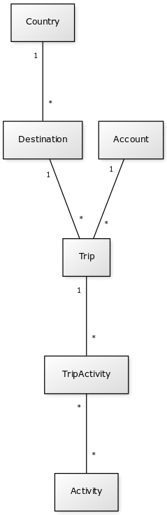

# Tietokannan dokumentaatio

Tietokannan UML-kaavio:

## Tietokanta taulut

### Country

Sisältää maan nimen ja tunnuksen.

### Destination

Matkan tapahtuma paikka.

### Trip

Matkan kohde.

### Activity

Toiminnallisuus.

### Account

Käyttäjätunnus.